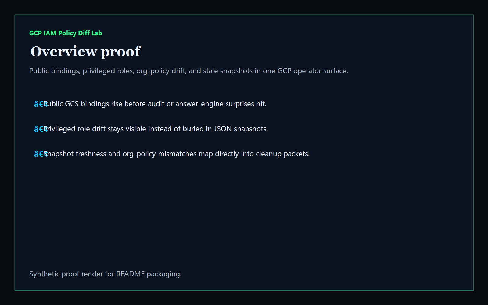
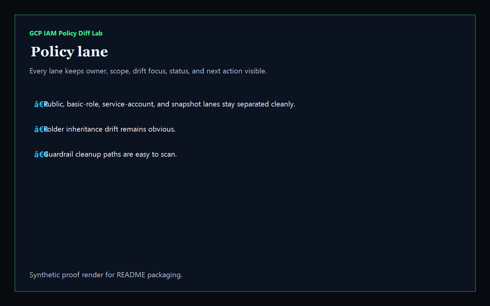
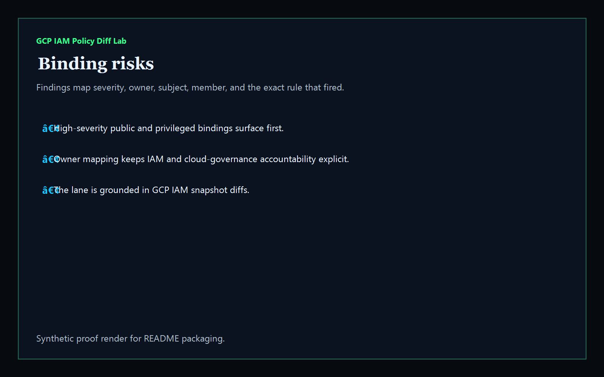
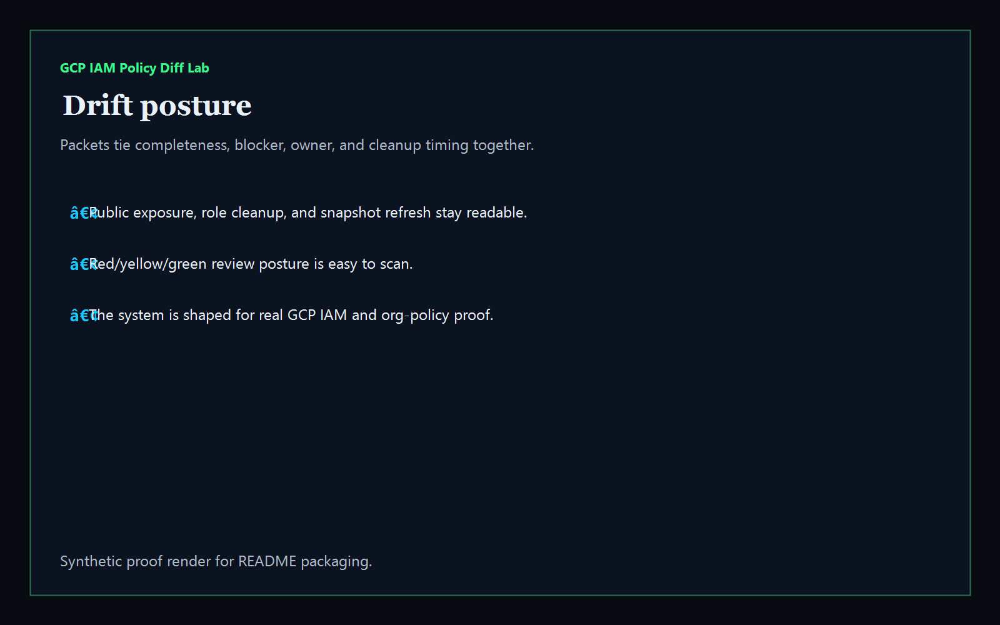

# gcp-iam-policy-diff-lab

[](https://github.com/mizcausevic-dev/gcp-iam-policy-diff-lab/actions/workflows/ci.yml)
[](./LICENSE)
[](https://github.com/mizcausevic-dev/gcp-iam-policy-diff-lab/actions/workflows/pages.yml)

Operator control plane for GCP IAM policy snapshots, public-binding drift, privileged role changes, org-policy mismatches, and remediation sequencing.

## Why this exists

- GCP IAM snapshots become dangerous when they stay trapped in raw exports instead of one operator-readable surface.
- Public bindings, privileged roles, and org-policy drift need to stay visible together before audits, incidents, or rollout windows drift.
- Recruiters looking for `GCP / IAM / org policy / cloud security` proof should see a real identity-and-guardrail dashboard, not a keyword page.
- This repo turns IAM policy diff data into a control plane for public bindings, role drift, stale snapshots, and policy-cleanup posture.

## Why this matters (KG Embedded tie-back)

This repo demonstrates the GCP identity-and-guardrail control-plane primitive for cloud operations: public bindings, privileged role drift, snapshot hygiene, and remediation packets in one operator surface. Kinetic Gain Embedded extends this pattern into productized in-app dashboards where platform, IAM, and security teams need evidence-rich surfaces without exposing raw admin backends or cloud credentials. See [kineticgain.com/embedded](https://kineticgain.com/embedded).

## What it shows

- `policy-lane` visibility for public bindings, basic-role drift, token creator grants, and snapshot hygiene in one dashboard
- `binding-risks` detection for `allUsers` exposure, `roles/editor` drift, service-account token creator grants, org-policy mismatch, and stale diff windows
- remediation packets for public cleanup, role replacement, token-creator review, and snapshot refresh
- offline-safe analysis of captured GCP IAM snapshot diffs
- recruiter-facing GCP IAM / cloud security proof that complements the Microsoft and AWS admin lanes

## Routes

- `/`
- `/policy-lane`
- `/binding-risks`
- `/drift-posture`
- `/verification`
- `/docs`

## API

- `/api/dashboard/summary`
- `/api/policy-lane`
- `/api/binding-risks`
- `/api/drift-posture`
- `/api/verification`
- `/api/sample`

## Screenshots






## CLI

```powershell
npx gcp-iam-policy-diff fixtures/gcp-policy-diff.json `
    --format json|markdown|summary `
    --now 2026-05-30T00:00:00Z `
    --stale-diff-after-hours 24 `
    --fail-on-high `
    --out report.md
```

Input shape:

```json
{
  "snapshots": [ ... ],
  "diffs": [ ... ]
}
```

## Local Development

```powershell
cd gcp-iam-policy-diff-lab
npm install
npm run dev
```

Open:
- [http://127.0.0.1:5515/](http://127.0.0.1:5515/)
- [http://127.0.0.1:5515/policy-lane](http://127.0.0.1:5515/policy-lane)
- [http://127.0.0.1:5515/binding-risks](http://127.0.0.1:5515/binding-risks)
- [http://127.0.0.1:5515/drift-posture](http://127.0.0.1:5515/drift-posture)
- [http://127.0.0.1:5515/verification](http://127.0.0.1:5515/verification)

## Validation

- `npm run lint`
- `npm run typecheck`
- `npm run coverage`
- `npm run build`
- `npm run demo`
- `npm run smoke`
- `npm run prerender`
- `npm run render:assets`

## Production status

| Aspect | Status |
|--------|--------|
| CI | Node 20 + 22 matrix — lint · typecheck · coverage · build · demo · smoke · prerender · `npm audit` |
| License | [AGPL-3.0-or-later](./LICENSE) |
| Deploy | Static prerender -> **https://gcp.kineticgain.com/** |
| Data posture | Synthetic sample data only; no live GCP credentials, project tokens, or production policy exports |
| Suite | Part of the [Kinetic Gain Protocol Suite](https://suite.kineticgain.com/) operator portfolio · apex: [kineticgain.com](https://kineticgain.com) |

## Docs

- [Kinetic Gain Embedded tie-back](./docs/KINETIC_GAIN_EMBEDDED.md)
- [Changelog](./CHANGELOG.md)

## Composes with

- [**`entra-access-review-control-plane`**](https://github.com/mizcausevic-dev/entra-access-review-control-plane) — Microsoft Entra access reviews
- [**`intune-device-compliance-ops`**](https://github.com/mizcausevic-dev/intune-device-compliance-ops) — Intune device compliance
- [**`aws-iam-access-analyzer-console`**](https://github.com/mizcausevic-dev/aws-iam-access-analyzer-console) — AWS IAM analyzer posture

Together they form a broader recruiter-facing cloud admin lane: Microsoft tenant governance plus AWS and GCP identity/perimeter proof.
